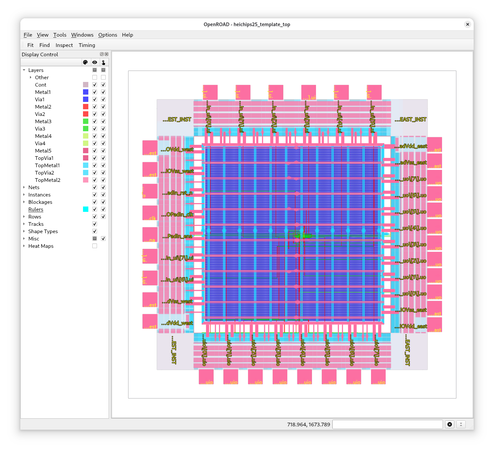

# Exercise 5 - Full Chip Design


> [!CAUTION]
> Full chip design with ihp-sg13g2 is currently still WIP.

In order to create a full chip design we need to generate a pad ring. LibreLane does not yet have support for automatic pad ring generation. However, we can make use of the experimental [leo/padring](https://github.com/librelane/librelane/tree/leo/padring) branch.

Instead of invoking `nix-shell` in the root of this repository, invoke `nix-shell` inside of this `bonus/` directory. That will enable the correct LibreLane version.

We also need a custom branch of the IHP Open PDK. Again, we use the branch [leo/padring](https://github.com/mole99/IHP-Open-PDK/tree/leo/padring).

Choose a destination folder and clone the PDK:

```
git clone git@github.com:mole99/IHP-Open-PDK.git --single-branch -b leo/padring
```

Before we start LibreLane, we need to export `PDK_ROOT` and `PDK`.

```
export PDK_ROOT=/path/to/pdk && export PDK=ihp-sg13g2
```

Now just run the flow:

```
librelane config.yaml --manual-pdk
```

The result should be something like this:



Congrats! 🎉
Feel free to edit `heichips25_template` to add your own design to the chip.