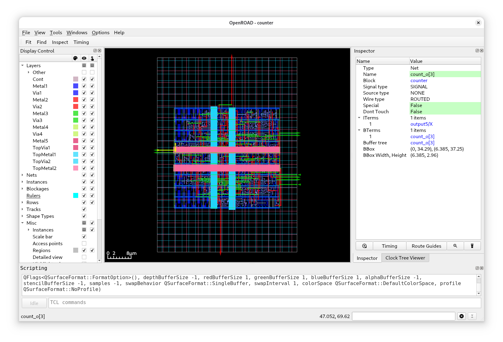
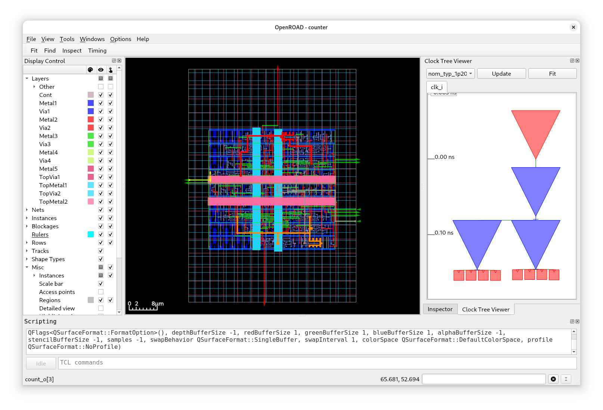
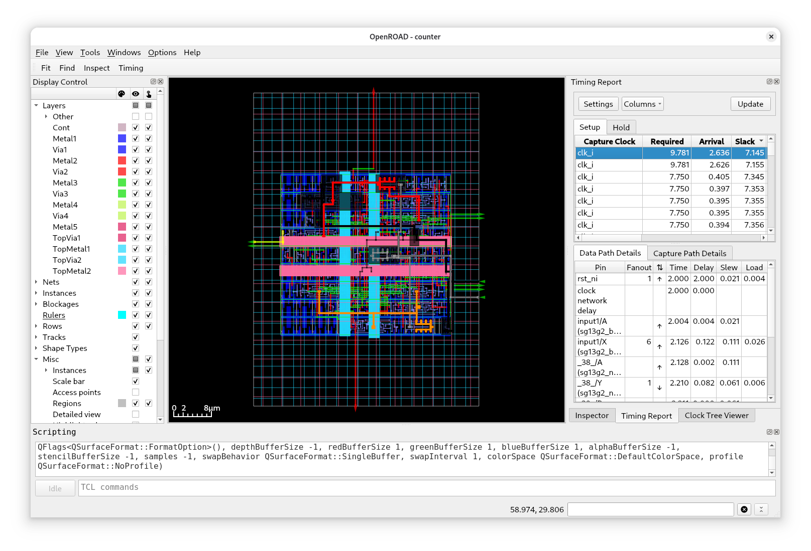
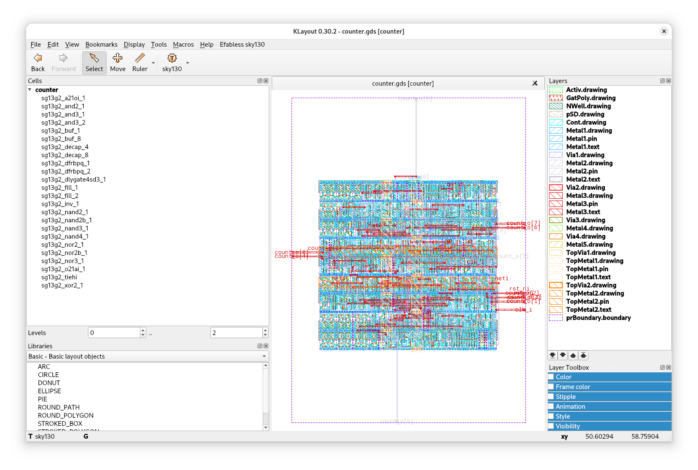

# Exercise 1 - Let's Implement a Counter

## 1.1 - Run LibreLane

We start the first exercise by implementing a simple counter. Make sure you have a shell with LibreLane enabled, and run the following command in this folder:

```
librelane --pdk ihp-sg13g2 config.yaml
```

By now, a lot of text should be scrolling by. While we wait, let me explain a few things:

This command invokes LibreLane with the ihp-sg13g2 PDK and the `config.yaml` configuration file.

> [!TIP]
> PDK stands for Process Design Kit and contains everything that we need for chip design.
> Normally, PDKs are only available under a Non-Disclosure Agreement (NDA), however thankfully there are open source PDKs that we can use for chip design.

We choose ihp-sg13g2 for HeiChips as the chip is going to be designed with the [IHP Open PDK](https://github.com/IHP-GmbH/IHP-Open-PDK) (ihp-sg13g2) to be manufactured using the [SG13G2](https://www.ihp-microelectronics.com/de/leistungen/forschungs-und-prototyping-service/mpw-prototyping-service/sigec-bicmos-technologien) process.

> [!NOTE]
> As of now the supported PDK families are sky130, gf180mcu and ihp-sg13g2.

By default LibreLane will manage the PDK for you. That includes selecting the right version of the PDK and downloading it. The default `PDK_ROOT` (the directory where all PDKs are stored) is in your home directory under `~/.ciel`. Why ciel?

[Ciel](https://github.com/fossi-foundation/ciel) is a version manager and builder for open-source PDKs. LibreLane uses ciel to manage the PDK that you have selected. By default LibreLane uses `sky130A` as the PDK, thus we changed it using `--pdk ihp-sg13g2`.

If you want to select a specific version of a PDK, you can tell LibreLane to do so with `--manual-pdk`. LibreLane will then use the `PDK_ROOT` and `PDK` environment variables, or the `--pdk-root` and `--pdk` arguments to find the PDK.

LibreLane supports a variety of configuration file formats such as `.tcl`, `.json` and `.yaml`. In this exercise you can find the `config.yaml` configuration file with a minimal configuration:

```yaml
DESIGN_NAME: counter
VERILOG_FILES: dir::counter.sv
CLOCK_PORT: clk_i
CLOCK_PERIOD: 10 # 10ns = 100MHz
```

The `DESIGN_NAME` is the top-level module of your design, in this case `counter`. `VERILOG_FILES` specifices all source files for your design. This can be a list of files, or even a wildcard such as `dir::path/to/my/files/*.sv`.
`CLOCK_PORT` is the, well, clock port of your design and `CLOCK_PERIOD` specifies at which clock period the design should operate at. LibreLane will use this information to run CTS (Clock Tree Synthesis) and set up the default SDC (Synopsys Design Constraint) file. For larger designs it could happen that the 100MHz are not achievable and LibreLane will report an error.

> [!TIP]
> LibreLane supports a vast number of variables to fully customize the design for your needs: https://librelane.readthedocs.io/en/latest/reference/step_config_vars.html


LibreLane runs the default [`Classic`](https://github.com/librelane/librelane/blob/d96f32212d025acd1d7acf01f395951cf3d4aa12/librelane/flows/classic.py#L31) flow which is the right choice for most designs. The flow consists of individual steps such as `Yosys.Synthesis` to synthesize your design, `OpenROAD.Floorplan` to create the boundaries of your design, `OpenROAD.GlobalPlacement` to place the standard cells (globally), and more.

After the flow has completed, LibreLane gives you a summary of potential errors, antenna violations, as well as DRC and LVS errors.

By now, LibreLane should be finished implementing the counter.
You should see the following green checkmarks:

```
* Antenna
Passed ✅

* LVS
Passed ✅

* DRC
Passed ✅
``` 

Along with maybe some warnings (which can be ignored in this case).

Congratulations! You have implemented your first design 🎉

## 1.2 - View Your Design

It would be quite boring if that was all. Luckily we can visualize the design using OpenROAD GUI and KLayout.

### 1.2.1 OpenROAD GUI

[OpenROAD](https://github.com/The-OpenROAD-Project/OpenROAD) is used by LibreLane to perform the physical design steps. It also has a GUI with which you can view and debug a design.

To open OpenROAD GUI, simply run the same command again with some additional arguments:

```
librelane --pdk ihp-sg13g2 config.yaml --last-run --flow OpenInOpenROAD 
```

`--last-run` tells LibreLane to re-use the last run folder with the latest state (we will talk about the run folder shortly). And `--flow OpenInOpenROAD` tells LibreLane to use the `OpenInOpenROAD` flow instead of the `Classic` flow for implementing designs.



You should see a similar view as in this image. In the center is your design with the display control on the left and the inspector on the right.

Take your time to discover all the features of OpenROAD GUI: you can disable certain layers, select cells, enable heatmaps and so on.
If you build larger designs, you will spend a lot of time in the GUI debugging certain problems.

One important point is the clock tree of your design. View it using the "Clock Tree Viewer". If not open, you can enable it in the top menu at "Windows" → "Clock Tree Viewer".

Click on "Update" and you should see the following:



Well, there's not much to see here because the design is so small. At the top is the root buffer (red triangle) followed by three other buffers (blue triangles). The leaves of the clock tree are connected to 8 flip-flops, one for each bit of the counter.
Notice how the clock traces in your design are now in color.

You can also view the timing paths of your design, open the "Timing Report" if not yet open: "Windows" → "Timing Report".

Click on "Update" and you can select a path:



> [!TIP]
> If you want to export your design in high resolution on a white background, just set "Display Control" → "Misc" → "Background" to white and run `save_image image.png -width 4096` in "Scripting". For the clock tree you can use: `save_clocktree_image`.

### 1.2.2 KLayout

While OpenROAD GUI opens the ODB (OpenDB) of your design, KLayout will load the LEF/DEF or the GDS of your design, containing all geometry information.

To open your design in KLayout run:

```
librelane --pdk ihp-sg13g2 config.yaml --last-run --flow OpenInKLayout
```

This should open the following window:



In the center you can see your design, on the left a hierarchy of the cells, and on the right the layers of ihp-sg13g2.

These are the layers (at least many of them) which are then sent to the foundry for manufacturing.

In KLayout you could also run DRC (Design Rule Check) and LVS (Layout Versus Schematic), however, LibreLane does this already for you as the final implementation checks.

Try to zoom in on the cells, select individual layers, and take measurements using the ruler.

## 1.3 - Discover the `run/` Directory

You may have noticed that a new directory was created while LibreLane was running: the `run/` directory.

If you take a look inside, you will see a number of run tags, such as `RUN_2025-07-31_13-49-44`, for each run you started.

Within these runs tags are the flow log, the error and the warning file, as well as directories for each step executed.

For example, if you open `13-openroad-floorplan`, you will find the input state (`state_in.json`), the output state (`state_out.json`) and a number of artifacts such as the `.odb` file of your design or the unpowered and powered netlist (`.nl.v` and `.pnl.v`).
Each step takes the input state, operates on it (possibly creating new files), and finally creates the output state.

For debugging purposes, it is very useful to have a look at the directory of the step that is failing.
