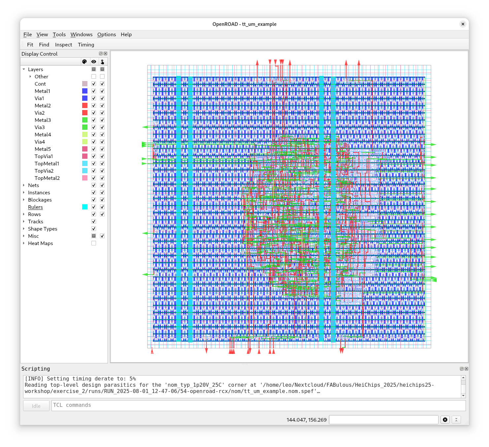

# Exercise 2 - All About Configuration Variables

For more advanced designs you will need to customize the flow and step configuration variables in LibreLane. 

In this exercise you will learn how to change flow and step configuration variables in LibreLane. 

## 2.1 - Set the Die Area

By default, LibreLane will automatically size the die area based on your design.

This is done as part of the [`OpenROAD.Floorplan`](https://librelane.readthedocs.io/en/latest/reference/step_config_vars.html#floorplan-initialization) step when `FP_SIZING: "relative"`.

If you want a fixed die size, let's say you're only given a certain amount of area, you need to set `FP_SIZING: absolute`.

Now we can set the die area using: `DIE_AREA: [0, 0, 150, 150]`. This will set the origin of the die area to 0 and the width and height to 150um.

However, there's another knob we can turn: density!
`PL_TARGET_DENSITY_PCT` specifies the target density of your design in percent.
Of course, this doesn't change the global density, which is specified by our die area and the number of cells.

Instead, the target density specifies the placement density of the cells. Imagine a large die area with a high target density.
You will get a lonely lump of standard cells somewhere in the center of your die area.

How sad. Let's try that!

Edit `config.yaml` with the following entries:

```yaml
FP_SIZING: absolute
DIE_AREA: [0, 0, 150, 150]
PL_TARGET_DENSITY_PCT: 80
```

And now, run the full flow.

And here's our lonely lump of standard cells:



Normally you want the smallest possible area with the highest possible density.
What prevents you in from cranking up the target density to 100%? Once the target density reaches a certain value, OpenROAD will have trouble routing your design - because everything is so dense!

**Your task** is now to find the smallest possible area with the highest target density.

Don't worry, if the target density is too low to fit the design into the given area, OpenROAD will tell you. And if it is too high, then routing will fail. It's a balancing act.

### 2.2 - Custom Pin Placement

By default, LibreLane will try to place the pins of your design as close to the cells where they are needed.

If you take a look at the [`Classic`](https://github.com/librelane/librelane/blob/d96f32212d025acd1d7acf01f395951cf3d4aa12/librelane/flows/classic.py#L40) flow, you will see the following arrangement of steps:

```
OpenROAD.GlobalPlacementSkipIO
OpenROAD.IOPlacement
OpenROAD.GlobalPlacement
```

First, the standard cells are placed without considering the I/O pins. In the next step, the I/O pins are placed as close to the cells where they are needed. In the third step, the cell placement is optimized once more by placing the cells again, now taking into account the placed pins.
However, often you can't freely decide where the pins should be placed.

How about we want all input pins on the left side of your macro, and all output pins on the right side?

This can be easily done in LibreLane with the [`Odb.CustomIOPlacement`](https://librelane.readthedocs.io/en/latest/reference/step_config_vars.html#custom-i-o-pin-placement-script) step. It expects the `FP_PIN_ORDER_CFG` variable that points to your pin placement configuration file.

What's a pin placement configuration file? Find out here: [Pin Placer Configuration Files](https://librelane.readthedocs.io/en/latest/reference/pin_placement_cfg.html)

Create a new file called `pins.cfg` and add the necessary entries to place all input pins on the left side of your macro, and all output pins on the right side. You may need to take a look at `src/project.sv`.

Finally, set the `FP_PIN_ORDER_CFG` variable to point to your pin placement configuration file:

```yaml
FP_PIN_ORDER_CFG: dir::pins.cfg
```

Run the flow, and the result should look like this (maybe you have a different die area):


### 2.3 - Use a DEF Template

Sometimes you need a fixed die size with a predetermined pin placement.
This the case for projects on [Tiny Tapeout](https://tinytapeout.com/). If you haven't noticed, `design.sv` uses the same interface as for Tiny Tapeout projects.

So how do we achieve this? Using a DEF template.

You can find the DEF templates provided by Tiny Tapeout in the `def/` folder. We will start with a 1x1 tile: `tt_block_1x1_pgvdd.def`.

The [Odb.ApplyDEFTemplate](https://librelane.readthedocs.io/en/latest/reference/step_config_vars.html#apply-def-template) step in LibreLane expects the `FP_DEF_TEMPLATE` variable to point to the DEF template you want to use.

Let's give this a try:

```yaml
FP_SIZING: absolute
DIE_AREA: [0, 0, 202.08, 154.98]
FP_DEF_TEMPLATE: dir::def/tt_block_1x1_pgvdd.def
```

Why do we have to specify the die area? Isn't that part of the DEF template? It is, and LibreLane will throw an error if it does not match up.


Nice! And ready for submission to Tiny Taepout.

Now, try some of the other DEF templates. But don't forget to adjust the die area!

### 2.4 - Placing Obstructions

Who doesn't like cheese? Lactose-intolerant perhaps...
Anyways, let's make some holes in our macro.

There are two ways to do that:

- `FP_OBSTRUCTIONS` - Obstructions applied at floorplanning stage. (firm)
- `PL_SOFT_OBSTRUCTIONS` - Soft placement blockages applied at the floorplanning stage. (soft)

The former will prevent any placement sites (standard cell rows) from being generated - no cells will every be placed there.
The latter will only prevent cells being placed during initial placement. Later, during buffer or antenna insertion, standard cells are allowed the be placed in this area.

For starters, try (I'm still using `tt_block_1x1_pgvdd.def`):

```yaml
FP_OBSTRUCTIONS:
- [30, 30, 40, 40]
- [120, 100, 150, 115]
- [100, 20, 180, 30]
```

And the result:


Whoever makes the most holes without breaking the flow wins!

### 2.5 - Other Useful Variables

Some other useful variables are:

- `SYNTH_STRATEGY` -  try different synth strategies targetting area or delay
- `VERILOG_DEFINES` - set a Verilog define during synthesis
- `GRT_ALLOW_CONGESTION` - allow congestion during global routing - detailed routing may still finish
- `GRT_ANTENNA_ITERS` - run more antenna insertion iterations
- `RSZ_DONT_TOUCH_RX` - don't resize a net or instance

Take a look at all of them: [Built-in Steps and their Configuration Variables](https://librelane.readthedocs.io/en/latest/reference/step_config_vars.html)