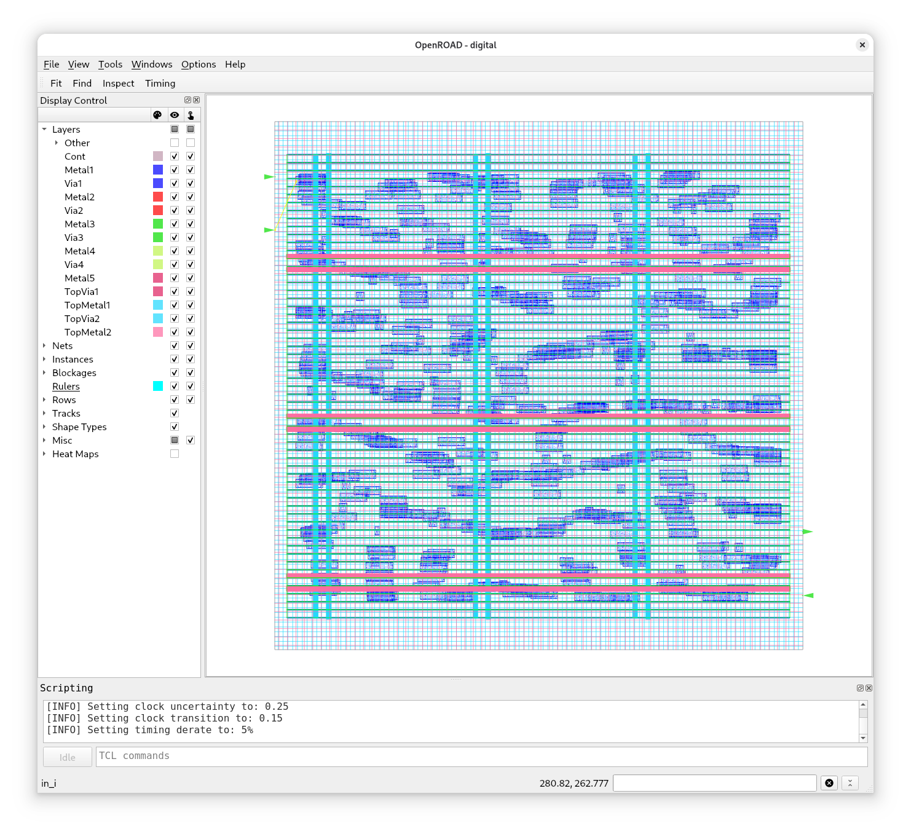

# Exercise 3 - Controlling the Flow

For small designs, it might be fine to always re-run the entire flow from start to finish during debugging.

For large designs with long iteration times, however, this can become annoying. Wouldn't it be nice if you could start another flow immediately after synthesis? Or only run up to a certain step because everything that follows is not yet important?

In this exercise, you will learn exactly how to do this.

## 3.1 - Run To a Step

The `Classic` flow is a so-called `SequentialFlow` that consists of a [number of steps](https://github.com/librelane/librelane/blob/d96f32212d025acd1d7acf01f395951cf3d4aa12/librelane/flows/classic.py#L40).

Let's say we only want to run up to `Yosys.Synthesis` as we're still debugging some issues there.

```
librelane --pdk ihp-sg13g2 config.yaml --to Yosys.Synthesis
```

Or even shorter:

```
librelane --pdk ihp-sg13g2 config.yaml -T Yosys.Synthesis
```

LibreLane runs and should report a number of skipped steps after `Yosys.Synthesis`.

Next, let's run to `OpenROAD.GlobalPlacement`.
I think you can do that yourself now, right?

Great! Now open OpenROAD GUI:

```
librelane --pdk ihp-sg13g2 config.yaml --last-run --flow OpenInOpenROAD
```

It should look something like this:



It almost feels organic, like a snake? That's because the design is a long shift-register, basically one long chain of flip-flops. At the `OpenROAD.GlobalPlacement` the instances are all placed - roughly - however the standard cells are not yet snapped into the standard cell grid. That's what `OpenROAD.DetailedPlacement` does.

So, let's see how we can run from `OpenROAD.GlobalPlacement` to `OpenROAD.DetailedPlacement`.

## 3.2 - Run From A Step

To do this we need to start the flow `from` a step.

```
librelane --pdk ihp-sg13g2 config.yaml --from OpenROAD.GlobalPlacement
```

Is this it? No yet. First, we need to tell LibreLane to use the last run directory and secondly, we need to specify the input state: after all there could be several steps of `OpenROAD.GlobalPlacement` in the run directory.

So, let's do this:

```
librelane --pdk ihp-sg13g2 config.yaml --last-run --from OpenROAD.GlobalPlacement --with-initial-state runs/<time_stamp>/28-openroad-globalplacement/state_in.json
```

Or in short:

```
librelane --pdk ihp-sg13g2 config.yaml --last-run -F OpenROAD.GlobalPlacement -i runs/<time_stamp>/28-openroad-globalplacement/state_in.json
```

> [!TIP]
> Take a look at `state_in.json`, if you're interested in what a state consists of. (It is basically a mapping from `DesignFormat` to the file on disk, plus the current metrics.)

Now, there should be a bunch of skipped steps at the start of the flow. However we forgot to limit the flow to `OpenROAD.DetailedPlacement`, therefore it will run until the end.

Thus, let's add the `to` argument as well:

```
librelane --pdk ihp-sg13g2 config.yaml --last-run --from OpenROAD.GlobalPlacement --with-initial-state runs/<time_stamp>/28-openroad-globalplacement/state_in.json --to OpenROAD.DetailedPlacement
```

## 3.3 Skip a Step

If you run the full flow, you will notice that `KLayout.DRC` takes up the majority of time. But who needs DRC anyway? So let's just disable it ;)

```
librelane --pdk ihp-sg13g2 config.yaml --skip KLayout.DRC
```

Or in short:

```
librelane --pdk ihp-sg13g2 config.yaml -S KLayout.DRC
```

Now you can enjoy the finished design, without knowing whether it passes DRC.

> [!TIP]
> There are other ways to manipulate flows in LibreLane. For example, you can do this directly in the configuration file. For more information see [Writing Custom Flows](https://librelane.readthedocs.io/en/latest/usage/writing_custom_flows.html).
